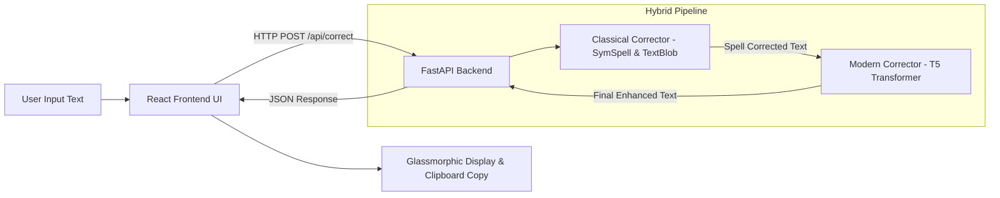

# 🧠 Neural Correct — AI Text & Grammar Correction System

[](https://www.python.org/)
[](https://fastapi.tiangolo.com/)
[](https://react.dev/)
[](https://vitejs.dev/)
[](https://pytorch.org/)
[](https://huggingface.co/)
[](LICENSE)

**Neural Correct** is a high-performance, hybrid text correction engine combining classical algorithmic lookup (`SymSpell` edit distance + `TextBlob`) with deep learning sequence-to-sequence neural models (`T5-base-grammar-correction`). It delivers instantaneous spelling fixes alongside context-aware syntactic grammatical refactoring.

---

## 🌟 Highlights & Features

- **⚡ Hybrid NLP Correction Pipeline**: Combines rapid symmetric edit-distance dictionary lookup with transformer neural beam search for high accuracy and minimal latency.
- **🎨 Glassmorphic Modern UI**: Built with React 19 & Vite featuring dynamic gradient glows, real-time word/character statistics, preset sample chips, and copy-to-clipboard actions.
- **🔌 RESTful FastAPI Backend**: Automatic OpenAPI documentation (`/docs`), status health checks (`/health`), and dynamic CORS origin validation.
- **📊 Evaluation Engine**: Built-in benchmark evaluator computing Word Error Rate (WER) using `jiwer`.
- **☁️ Cloud & Container Ready**: Out-of-the-box deployment configs including `render.yaml`, `Dockerfile`, and `vercel.json`.

---

## 🏗 System Architecture



---

## 📁 Repository Structure

```
.
├── backend/
│   ├── api.py                    # FastAPI application endpoints
│   ├── classical_corrector.py     # SymSpell compound lookup engine
│   ├── modern_corrector.py        # HuggingFace T5 Seq2Seq grammar model
│   ├── evaluate_models.py         # WER evaluation harness
│   ├── requirements.txt           # Python dependencies
│   ├── Dockerfile                 # Container setup for API deployment
│   └── .env.example               # Backend environment template
├── frontend/
│   ├── src/
│   │   ├── App.jsx                # React glassmorphic app component
│   │   ├── index.css              # Custom styling & animations
│   │   └── main.jsx               # Entry point
│   ├── package.json               # Node.js dependencies
│   ├── vite.config.js             # Vite bundler configuration
│   ├── vercel.json                # Vercel deployment rewrite rules
│   └── .env.example               # Frontend environment template
├── render.yaml                    # Render blueprint deployment definition
├── .gitignore                     # Git tracking exclusions
└── README.md                      # Documentation
```

---

## 🚀 Local Quickstart Guide

### Prerequisites
- **Python 3.10+** installed
- **Node.js 18+** & **npm** installed

---

### 1️⃣ Setting Up the Backend

```bash
# Navigate to backend directory
cd backend

# Create virtual environment
python -m venv venv

# Activate virtual environment
# On Windows:
venv\Scripts\activate
# On macOS/Linux:
source venv/bin/activate

# Install requirements
pip install -r requirements.txt

# Start FastAPI dev server
python api.py
```

The backend server will run at: `http://localhost:8000`  
Swagger API Docs available at: `http://localhost:8000/docs`

---

### 2️⃣ Setting Up the Frontend

```bash
# Navigate to frontend directory
cd frontend

# Install Node dependencies
npm install

# Start Vite dev server
npm run dev
```

The frontend application will launch at: `http://localhost:5173`

---

## 🌐 Production Deployment Guide

### Option A: Deploy Backend on Render (Free Tier)
1. Push this repository to **GitHub**.
2. Log in to [Render.com](https://render.com/).
3. Click **New +** → **Blueprint**.
4. Connect your GitHub repository. Render will automatically detect `render.yaml` and provision the FastAPI web service!
5. Copy your deployed backend URL (e.g., `https://neural-correct-api.onrender.com`).

### Option B: Deploy Frontend on Vercel
1. Log in to [Vercel.com](https://vercel.com/).
2. Click **Add New** → **Project** and select your GitHub repository.
3. Set the **Root Directory** to `frontend`.
4. Add Environment Variable:
   - Name: `VITE_API_URL`
   - Value: `https://your-backend-api.onrender.com`
5. Click **Deploy**.

---

## 📡 API Reference

### Health Check
`GET /health`

**Response:**
```json
{
  "status": "online",
  "active_model": "modern (Hybrid Pipeline)"
}
```

### Text Correction
`POST /api/correct`

**Request Body:**
```json
{
  "text": "I am writting a leter to you"
}
```

**Response Body:**
```json
{
  "original_text": "I am writting a leter to you",
  "corrected_text": "I am writing a letter to you",
  "model_used": "modern (Hybrid Pipeline)"
}
```

---

## 🧪 Model Evaluation

Run model evaluation locally to measure Word Error Rate (WER):

```bash
python backend/evaluate_models.py
```

---

## 📄 License

This project is open-source and licensed under the [MIT License](LICENSE).
